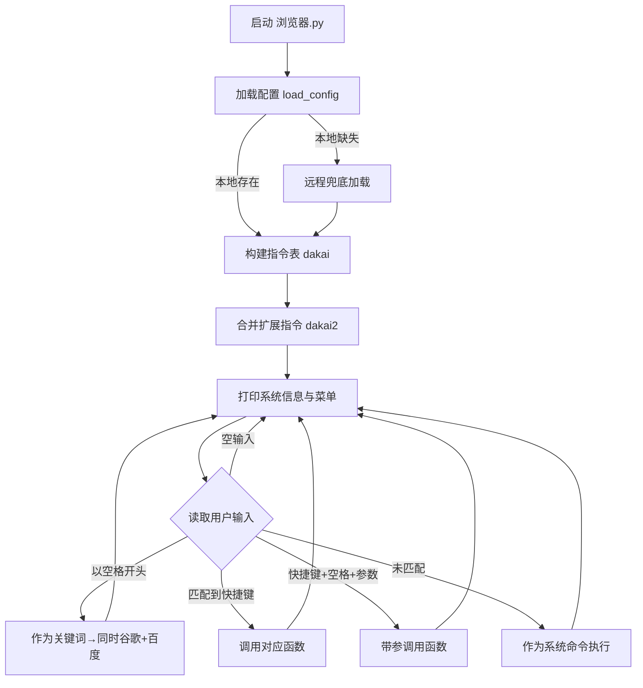

# 浏览器（命令行快捷启动器）

一个用于个人效率提升的命令行“浏览器”，通过简短指令快速打开常用网站、执行搜索、启动系统命令或打开目录。支持自定义扩展与配置文件驱动，开箱即用、可按需扩展。

—— 个人工具，但通用思路与方式可复用。

## 功能特性

- 快速检索：一键同时 Google + 百度（或单独百度），知乎/百科/购物等场景化搜索
- 常用工具：正则工具（在线）、IP 查询、网络连通性测试 `ping`、远程桌面 `mstsc`
- 目录直达：一键打开“工作目录”“学习目录”（从配置读取）
- 站点直达：MOOC、阿里镜像等快捷入口；支持 CSDN 搜索
- 扩展便捷：通过 `se.py` 增量注册快捷键；通过 `configs/config.yaml` 管理 URL/目录
- 美观菜单：使用 `rich` 输出彩色表格，帮助记忆快捷键
- 兜底执行：未匹配到快捷键时，输入将作为系统命令直接执行

## 目录与架构

```
├─ 浏览器.py                 # 入口：命令行交互与主循环
├─ se.py                     # 扩展项注册（可按需添加快捷键）
├─ requirements.txt          # 依赖清单
├─ configs/
│  └─ config.yaml            # 配置（目录与站点 URL）
├─ lib/
│  ├─ func_1.py              # 通用功能（搜索/打开/网络/系统命令等）
│  ├─ func_2.py              # 配置加载（本地/远程兜底）
│  └─ os_file.py             # 预留（当前未使用）
└─ gong_neng/
   └─ zaxiang.py            # 杂项功能（文本分行替换等）
```

模块职责概览：
- `浏览器.py`：读取配置→构建指令表→打印菜单→解析输入→分发执行（未匹配则当作系统命令执行）
- `lib/func_1.py`：封装各类打开/搜索（百度/谷歌/知乎/百科/购物）、网络工具（ping、ipconfig、mstsc）、站点入口等
- `lib/func_2.py`：加载配置；若本地 `configs/config.yaml` 缺失，尝试从远程加载兜底
- `gong_neng/zaxiang.py`：杂项工具（按指定分隔符换行替换等）
- `se.py`：以字典 `dakai2` 的形式注册扩展快捷键（与主指令表合并）

## 指令清单（内置 + 扩展）

以下为默认内置指令（来自 `浏览器.py` 与 `lib/func_1.py`）：

- `1`：谷歌+百度 一次搜（`yixia`）
- `2`：百科检索（维基+百度百科）（`zhidao`）
- `3`：知乎搜索（`zhihu`）
- `4`：购物搜索（淘宝+京东）（`shopping`）
- `12`：综合检索（1 与 2 同时）（`hebin`）
- `b`：仅百度（`baidu`）
- `z`：正则工具（打开在线工具）（`zhengze`）
- `ip`：查看 IP（附加示例：`ip a=/all` 显示全部）（`ipconfig`）
- `al`：显示/打开阿里镜像（`open_ali`）
- `wd`：打开“工作目录”（来自配置 `work_dir`）（`wd`）
- `ed`：打开“学习目录”（来自配置 `edu_dir`）（`wd`）
- `p`：`ping` 测试（示例：`p 8.8.8.8`）（`ping`）
- `h`：打印指令菜单（`dayin`）
- `m`：远程桌面 `mstsc`（可带目标）（`mstsc`）
- `xh`：输出学号（`xh`）

扩展指令（来自 `se.py` 的 `dakai2`）：
- `mo`：打开 MOOC（URL 来自配置 `mooc_url`）（`open_web`）
- `cs`：搜索 CSDN（`open_web2`，示例：`cs python 多进程`）

输入规则与示例：
- 直接输入快捷键：`1`（再提示输入关键词）
- 快捷键 + 空格 + 参数：`b asyncio 并发`、`p 8.8.8.8`
- 以空格开头 + 文本：将文本作为搜索关键词，等价于快捷键 `1`（同时用谷歌+百度检索），如：`  数据结构 面试题`
- 未匹配到的输入：当作系统命令执行，例如：`ipconfig /all`

## 配置说明

配置文件：`configs/config.yaml`（YAML，UTF-8）

示例（节选）：

```yaml
COMMON: &common
  work_dir: "F:\\work"
  edu_dir: "F:\\now2"
  mooc_url: "https://www.icourse163.org/home.htm?userId=..."
  work_url: "http://task.ngrok.groupinno.com/"

CX1: &cx1
  << : *common
  name: "cx1"
```

说明：
- 程序默认读取 `COMMON` 节点；缺失本地配置时会尝试从远程拉取兜底配置（`gitee`），离线场景请保证本地文件存在
- `work_dir`、`edu_dir`：供 `wd`、`ed` 指令打开目录
- `work_url`：用于 `w1`（任务列表）与 `is`（任务详情）
- `mooc_url`：用于 `mo` 指令

## 运行说明

环境要求：
- Python 3.x（建议 3.8+）
- Windows 平台（部分指令依赖 `mstsc`、`explorer` 等）

安装与启动：
1. 安装 Python
2. 安装依赖：
   - 运行 `安装依赖.bat`，或在命令行执行：`pip install -r requirements.txt`
3. 启动：
   - 方式 A：运行 `浏览器快捷3.exe`
   - 方式 B：命令行执行：`python 浏览器.py`

## 后台热键唤醒

- 新增 `hotkey_runner.py`：后台监听全局热键。
  - `Alt+F1`：唤起主界面（在新控制台启动 `浏览器.py`）
  - `Alt+Shift+F2`：退出热键监听器
- 启动方式：
  - 双击运行 `后台运行(Alt+F1唤醒).bat`（优先用 `pythonw.exe` 实现无控制台后台）
  - 或命令行执行：`pythonw hotkey_runner.py`（无控制台）/ `python hotkey_runner.py`（有控制台）
- 备注：
  - 需要 `pywin32`（已在 `requirements.txt` 中）。
  - 若热键无效，确认是否存在快捷键冲突，或以管理员权限运行。
  - 再次按 `Alt+F1` 时，若已有主界面在运行，将不会重复打开。

## 工作流图



## 扩展与二次开发

- 在 `se.py` 的 `dakai2` 中追加：
  - 不带参数：`'mo': [open_web, '打开 mooc', 'mooc_url']`
  - 带参数：`'cs': [open_web2, '搜索 CSDN', 'https://so.csdn.net/so/search?q={}&t=&u=']`
- 在 `configs/config.yaml` 添加对应键值（如站点 URL 或目录）
- 也可在 `浏览器.py` 中为 `dakai` 追加自定义函数（建议封装到 `lib/` 后在此注册）

## 注意事项

- 首次启动会异步发送一个轻量请求用于统计（`lib/func_1.py:start_1`），若在隔离网络环境可忽略；也可按需移除该调用
- `lib/os_file.py` 为预留文件，当前未被使用
- 所有代码与文档请使用 UTF-8 编码保存

## 变更记录（节选）

- 增加 `ip`/`mstsc`/`w1`/`is` 等能力；引入 `rich` 提升菜单可读性
- 支持 `configs/config.yaml`，并可从远程兜底加载
- 提供扩展字典 `dakai2`，便于以增量方式扩展快捷键
